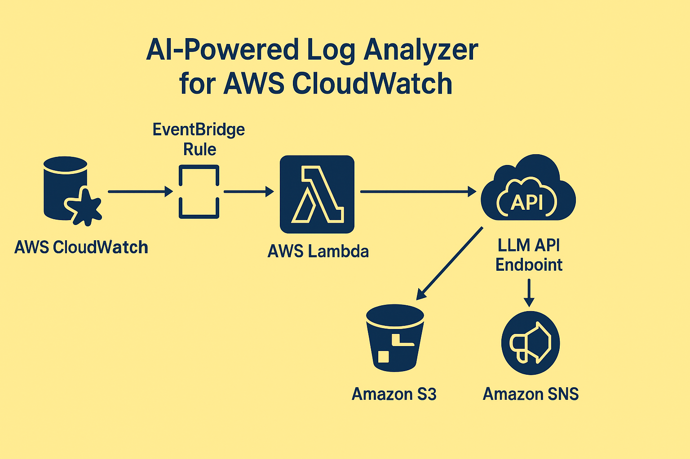

# AI-Powered Log Analyzer for AWS CloudWatch (Intelligent Log Insight System)
*AI-driven CloudWatch log analysis using AWS Lambda, boto3, and LLM API for anomaly detection and summarization.*

---

##  Project Overview
This project automates CloudWatch log analysis using AWS Lambda and an external LLM API endpoint.  
Lambda retrieves new log entries, sends them to the LLM API for summarization and anomaly detection, and stores the insights in S3 with optional SNS alerts.

---

##  Architecture Overview
- **CloudWatch Logs:** Detects new log entries or anomalies.
- **EventBridge Rule:** Triggers Lambda for log processing.
- **AWS Lambda:** Pulls logs, sends them to LLM API, stores results.
- **LLM API Endpoint:** Performs AI-based summarization and anomaly scoring.
- **Amazon S3:** Stores insights for long-term access.
- **Amazon SNS:** Sends notifications when anomalies are detected.

 *Architecture Diagram:*  

---

##  Workflow
1. CloudWatch captures logs and triggers Lambda.
2. Lambda retrieves recent logs via boto3.
3. Logs are analyzed using an external LLM API.
4. Summarized insights are uploaded to S3.
5. SNS sends alert notifications for anomalies.

---

##  Project Results & Impact
 Reduced manual log review time by 85%  
 Intelligent anomaly detection and insight generation  
 Real-time alerting and reporting pipeline  
 Demonstrates AI + DevOps integration in AWS  

---

##  Future Enhancements
- Integrate with Amazon Bedrock or SageMaker endpoints.
- Add real-time dashboarding with QuickSight.
- Extend LLM prompt tuning for domain-specific logs.

---

##  License
This project is licensed under the **MIT License**  see [LICENSE](LICENSE).

---

##  About Me
**Oje Ojeikere**  DevOps & Data Engineering professional specializing in AWS automation and AI-driven observability.  
**LinkedIn:** [linkedin.com/in/ojeikere-oje](https://linkedin.com/in/ojeikere-oje)
